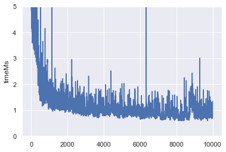
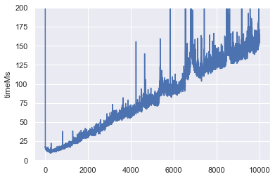
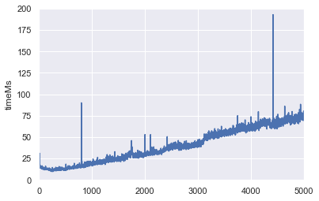
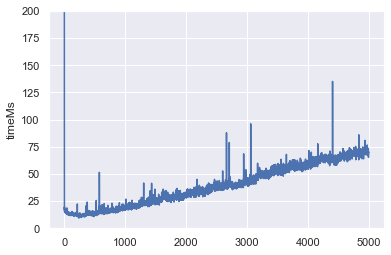
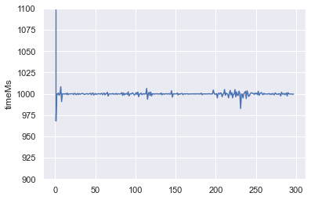
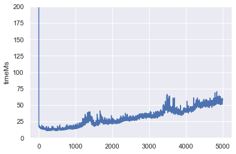
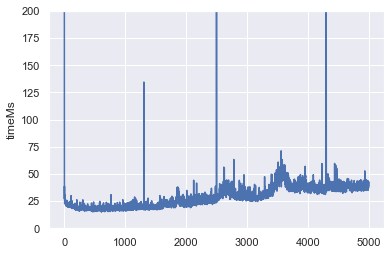
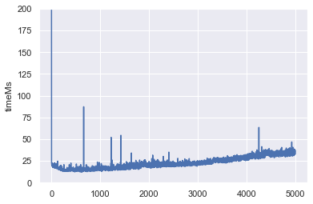
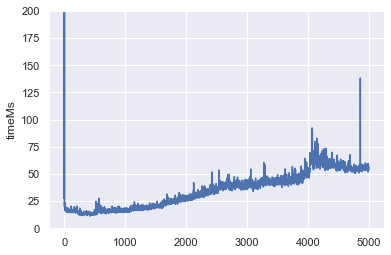
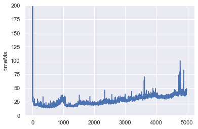

# Experiment Overview

With this experiment we want to identify whether having many reminders slows down reminder creation/execution, and how partitoining helps to reduce negative effects.
We do not benchmark how many actors can be actively processing / being reminded at the same time; this would be pointless as this just benchmarks this computer for this purpose.

## Actor scalability (exp1)

- Git commit: c934bc86 (addReminder must be commented)

Motivation: Check the overhead of starting actors without reminders. We need this to understand later the effects of reminders since only they require persistence.

Setup:

- Start 10000 actors in a loop
- Each actors executes the doSomething method (does nothing but makes sure it is activated)
- Actor deactivation timeout is 5000 seconds

Result:
- Nothing is written to Redis (expected since we do not modify/store state)
- O(1)



## Registration scaleability (exp2)

- Git-commit: c934bc86

Motivation: Check if the overhead of registering reminders and starting actors is linear

Setup:

- Start 10000 actors in a loop
- Each actor registers a reminder on startup that will trigger in 5000 seconds
- Actor deactivation timeout is 5000 seconds

Result:

- Redis has a key for all reminders, values comprises a list with 10000 elements (none are missing)
- Program does not stop properly -> no print-out at the end
- CPU load is high on DemoActorService, the client has a low load
- O(n)



DemoActorClient log:
```bash
== APP == Starting Actors.
2021/11/10 13:02:09 failed to send the request: Post "http://localhost:9411/api/v2/spans": dial tcp [::1]:9411: connect: connection refused
2021/11/10 13:02:10 failed to send the request: Post "http://localhost:9411/api/v2/spans": EOF
2021/11/10 13:02:11 failed to send the request: Post "http://localhost:9411/api/v2/spans": EOF
2021/11/10 13:02:12 failed to send the request: Post "http://localhost:9411/api/v2/spans": EOF
2021/11/10 13:02:12 failed to send the request: Post "http://localhost:9411/api/v2/spans": EOF
2021/11/10 13:02:12 failed to send the request: Post "http://localhost:9411/api/v2/spans": EOF
2021/11/10 13:02:12 failed to send the request: Post "http://localhost:9411/api/v2/spans": EOF
2021/11/10 13:02:12 failed to send the request: Post "http://localhost:9411/api/v2/spans": read tcp [::1]:49613->[::1]:9411: read: connection reset by peer
2021/11/10 13:02:12 failed to send the request: Post "http://localhost:9411/api/v2/spans": read tcp [::1]:49615->[::1]:9411: read: connection reset by peer
2021/11/10 13:02:13 failed to send the request: Post "http://localhost:9411/api/v2/spans": EOF
2021/11/10 13:02:13 failed to send the request: Post "http://localhost:9411/api/v2/spans": EOF
2021/11/10 13:02:13 failed to send the request: Post "http://localhost:9411/api/v2/spans": EOF
2021/11/10 13:02:13 failed to send the request: Post "http://localhost:9411/api/v2/spans": EOF
2021/11/10 13:02:13 failed to send the request: Post "http://localhost:9411/api/v2/spans": EOF
2021/11/10 13:02:13 failed to send the request: Post "http://localhost:9411/api/v2/spans": EOF
2021/11/10 13:02:13 failed to send the request: Post "http://localhost:9411/api/v2/spans": EOF
2021/11/10 13:02:13 failed to send the request: Post "http://localhost:9411/api/v2/spans": EOF
2021/11/10 13:02:13 failed to send the request: Post "http://localhost:9411/api/v2/spans": EOF
2021/11/10 13:02:13 failed to send the request: Post "http://localhost:9411/api/v2/spans": EOF
2021/11/10 13:02:13 failed to send the request: Post "http://localhost:9411/api/v2/spans": EOF
2021/11/10 13:02:13 failed to send the request: Post "http://localhost:9411/api/v2/spans": EOF
2021/11/10 13:02:13 failed to send the request: Post "http://localhost:9411/api/v2/spans": EOF
2021/11/10 13:02:13 failed to send the request: Post "http://localhost:9411/api/v2/spans": EOF
2021/11/10 13:02:13 failed to send the request: Post "http://localhost:9411/api/v2/spans": EOF
2021/11/10 13:02:13 failed to send the request: Post "http://localhost:9411/api/v2/spans": EOF
2021/11/10 13:02:13 failed to send the request: Post "http://localhost:9411/api/v2/spans": EOF
2021/11/10 13:02:13 failed to send the request: Post "http://localhost:9411/api/v2/spans": EOF
2021/11/10 13:02:14 failed to send the request: Post "http://localhost:9411/api/v2/spans": EOF
2021/11/10 13:02:14 failed to send the request: Post "http://localhost:9411/api/v2/spans": EOF
2021/11/10 13:02:14 failed to send the request: Post "http://localhost:9411/api/v2/spans": EOF
2021/11/10 13:02:14 failed to send the request: Post "http://localhost:9411/api/v2/spans": EOF
2021/11/10 13:02:14 failed to send the request: Post "http://localhost:9411/api/v2/spans": EOF
2021/11/10 13:02:14 failed to send the request: Post "http://localhost:9411/api/v2/spans": EOF
2021/11/10 13:02:14 failed to send the request: Post "http://localhost:9411/api/v2/spans": EOF
2021/11/10 13:02:14 failed to send the request: Post "http://localhost:9411/api/v2/spans": EOF
2021/11/10 13:02:14 failed to send the request: Post "http://localhost:9411/api/v2/spans": EOF
2021/11/10 13:02:14 failed to send the request: Post "http://localhost:9411/api/v2/spans": EOF
2021/11/10 13:02:14 failed to send the request: Post "http://localhost:9411/api/v2/spans": EOF
2021/11/10 13:02:14 failed to send the request: Post "http://localhost:9411/api/v2/spans": EOF
2021/11/10 13:02:14 failed to send the request: Post "http://localhost:9411/api/v2/spans": EOF
2021/11/10 13:02:14 failed to send the request: Post "http://localhost:9411/api/v2/spans": EOF
2021/11/10 13:02:14 failed to send the request: Post "http://localhost:9411/api/v2/spans": EOF
2021/11/10 13:02:14 failed to send the request: Post "http://localhost:9411/api/v2/spans": EOF
2021/11/10 13:02:14 failed to send the request: Post "http://localhost:9411/api/v2/spans": EOF
2021/11/10 13:02:14 failed to send the request: Post "http://localhost:9411/api/v2/spans": EOF
2021/11/10 13:02:14 failed to send the request: Post "http://localhost:9411/api/v2/spans": EOF
2021/11/10 13:02:14 failed to send the request: Post "http://localhost:9411/api/v2/spans": EOF
2021/11/10 13:02:15 failed to send the request: Post "http://localhost:9411/api/v2/spans": EOF
2021/11/10 13:02:15 failed to send the request: Post "http://localhost:9411/api/v2/spans": EOF
2021/11/10 13:02:15 failed to send the request: Post "http://localhost:9411/api/v2/spans": EOF
2021/11/10 13:02:15 failed to send the request: Post "http://localhost:9411/api/v2/spans": EOF
2021/11/10 13:02:15 failed to send the request: Post "http://localhost:9411/api/v2/spans": EOF
2021/11/10 13:02:15 failed to send the request: Post "http://localhost:9411/api/v2/spans": EOF
2021/11/10 13:02:15 failed to send the request: Post "http://localhost:9411/api/v2/spans": EOF
2021/11/10 13:02:15 failed to send the request: Post "http://localhost:9411/api/v2/spans": EOF
2021/11/10 13:02:15 failed to send the request: Post "http://localhost:9411/api/v2/spans": EOF
2021/11/10 13:02:15 failed to send the request: Post "http://localhost:9411/api/v2/spans": EOF
== APP == Done.
```

Repeated the experiment (exp2a = bfd1ae39) later with 5000 actors and a 10 second brake after 2500 actors to study if this has any effect on latency **Stopping does not change the latency, but CPU load almost zero during brake**



## Reminder scalability for deactivated actors that have reminders (exp3)

- Git-commit: 21974a72

Motivation: Check how the total number of reminders affects the scheduling of a single reminder. In other words: while I am adding more and more actors with reminders (which are not triggered), does a single reminder that is continiously triggered being slowed down?

Setup:
- Start 5000 actors in a loop
- The first actors registers a reminder on startup that will trigger each second
- All other actors register a reminder that will trigger in 5000 seconds (took 00:03:19)
- Actor deactivation is set to 2 seconds
- Let it run until 00:05:00

Results:

- Redis has a key for all reminders, values comprises a list with 5000 elements (none are missing)
- Redis has a fields for lastWakeup; version after run is 298
- Latency behaves similar to exp2



- Total number of reminders does not affect the scheduling of a single reminder



## Findings so far

- Actors that do not have reminders do not slow us down
- Each actor with a reminder makes it more expensive to add new actors. Possible reasons
    - Caused by all reminders in same database key -> using partitioning would fix this
    - Caused by Dapr overloaded -> small brake while adding in exp2 would fix this, does not (exp2a)
- Number of (waiting) reminders in database does not impact reminder execution

If partitioning helps for writes, this means:
- Reminder execution is not slowed down by having many reminders (at least if they are waiting)
- Reminder creation is slowed down by having many reminders, even if they are waiting

## Registration scalability with partitions (exp4)

- Git-commit: 7b8acff6

Motivation: Find out whether two partitions infleunces reminder creation latency (quite similar to exp2a)

Setup:
- Activated experimental metadata feature for this experiment, the others were without this feature
- Start 5000 actors in a loop
- Each actor registers a reminder on startup that will trigger in 5000 seconds
- Actor deactivation timeout is 5000 seconds
- Use 2 reminder partitions

Results:
- Redis has two keys for reminders (both have 2500 reminders, none are missing) and a meta data key (that got updated 5002 times)
- Reminder creation is slightly faster but partitoins seems not to be very effective for speeding things up



- There were a lot of errors:

DemoActorClient log:
```bash
== APP == Starting Actors.
2021/11/10 15:09:22 failed to send the request: Post "http://localhost:9411/api/v2/spans": EOF
2021/11/10 15:09:22 failed to send the request: Post "http://localhost:9411/api/v2/spans": EOF
2021/11/10 15:09:22 failed to send the request: Post "http://localhost:9411/api/v2/spans": EOF
2021/11/10 15:09:22 failed to send the request: Post "http://localhost:9411/api/v2/spans": EOF
2021/11/10 15:09:22 failed to send the request: Post "http://localhost:9411/api/v2/spans": dial tcp [::1]:9411: connect: connection refused
2021/11/10 15:09:22 failed to send the request: Post "http://localhost:9411/api/v2/spans": dial tcp [::1]:9411: connect: connection refused
2021/11/10 15:09:22 failed to send the request: Post "http://localhost:9411/api/v2/spans": dial tcp [::1]:9411: connect: connection refused
2021/11/10 15:09:22 failed to send the request: Post "http://localhost:9411/api/v2/spans": dial tcp [::1]:9411: connect: connection refused
2021/11/10 15:09:22 failed to send the request: Post "http://localhost:9411/api/v2/spans": dial tcp [::1]:9411: connect: connection refused
2021/11/10 15:09:22 failed to send the request: Post "http://localhost:9411/api/v2/spans": dial tcp [::1]:9411: connect: connection refused
2021/11/10 15:09:22 failed to send the request: Post "http://localhost:9411/api/v2/spans": dial tcp [::1]:9411: connect: connection refused
2021/11/10 15:09:22 failed to send the request: Post "http://localhost:9411/api/v2/spans": dial tcp [::1]:9411: connect: connection refused
2021/11/10 15:09:22 failed to send the request: Post "http://localhost:9411/api/v2/spans": dial tcp [::1]:9411: connect: connection refused
2021/11/10 15:09:22 failed to send the request: Post "http://localhost:9411/api/v2/spans": dial tcp [::1]:9411: connect: connection refused
2021/11/10 15:09:22 failed to send the request: Post "http://localhost:9411/api/v2/spans": dial tcp [::1]:9411: connect: connection refused
2021/11/10 15:09:22 failed to send the request: Post "http://localhost:9411/api/v2/spans": dial tcp [::1]:9411: connect: connection refused
2021/11/10 15:09:22 failed to send the request: Post "http://localhost:9411/api/v2/spans": dial tcp [::1]:9411: connect: connection refused
2021/11/10 15:09:22 failed to send the request: Post "http://localhost:9411/api/v2/spans": dial tcp [::1]:9411: connect: connection refused
2021/11/10 15:09:22 failed to send the request: Post "http://localhost:9411/api/v2/spans": dial tcp [::1]:9411: connect: connection refused
2021/11/10 15:09:22 failed to send the request: Post "http://localhost:9411/api/v2/spans": dial tcp [::1]:9411: connect: connection refused
2021/11/10 15:09:22 failed to send the request: Post "http://localhost:9411/api/v2/spans": dial tcp [::1]:9411: connect: connection refused
2021/11/10 15:09:22 failed to send the request: Post "http://localhost:9411/api/v2/spans": dial tcp [::1]:9411: connect: connection refused
2021/11/10 15:09:22 failed to send the request: Post "http://localhost:9411/api/v2/spans": dial tcp [::1]:9411: connect: connection refused
2021/11/10 15:09:22 failed to send the request: Post "http://localhost:9411/api/v2/spans": dial tcp [::1]:9411: connect: connection refused
2021/11/10 15:09:22 failed to send the request: Post "http://localhost:9411/api/v2/spans": dial tcp [::1]:9411: connect: connection refused
2021/11/10 15:09:22 failed to send the request: Post "http://localhost:9411/api/v2/spans": dial tcp [::1]:9411: connect: connection refused
2021/11/10 15:09:22 failed to send the request: Post "http://localhost:9411/api/v2/spans": dial tcp [::1]:9411: connect: connection refused
2021/11/10 15:09:22 failed to send the request: Post "http://localhost:9411/api/v2/spans": dial tcp [::1]:9411: connect: connection refused
2021/11/10 15:09:22 failed to send the request: Post "http://localhost:9411/api/v2/spans": dial tcp [::1]:9411: connect: connection refused
2021/11/10 15:09:22 failed to send the request: Post "http://localhost:9411/api/v2/spans": dial tcp [::1]:9411: connect: connection refused
2021/11/10 15:09:23 failed to send the request: Post "http://localhost:9411/api/v2/spans": dial tcp [::1]:9411: connect: connection refused
2021/11/10 15:09:23 failed to send the request: Post "http://localhost:9411/api/v2/spans": dial tcp [::1]:9411: connect: connection refused
2021/11/10 15:09:23 failed to send the request: Post "http://localhost:9411/api/v2/spans": dial tcp [::1]:9411: connect: connection refused
2021/11/10 15:09:23 failed to send the request: Post "http://localhost:9411/api/v2/spans": dial tcp [::1]:9411: connect: connection refused
2021/11/10 15:09:23 failed to send the request: Post "http://localhost:9411/api/v2/spans": dial tcp [::1]:9411: connect: connection refused
2021/11/10 15:09:23 failed to send the request: Post "http://localhost:9411/api/v2/spans": dial tcp [::1]:9411: connect: connection refused
2021/11/10 15:09:23 failed to send the request: Post "http://localhost:9411/api/v2/spans": dial tcp [::1]:9411: connect: connection refused
2021/11/10 15:09:23 failed to send the request: Post "http://localhost:9411/api/v2/spans": dial tcp [::1]:9411: connect: connection refused
2021/11/10 15:09:23 failed to send the request: Post "http://localhost:9411/api/v2/spans": dial tcp [::1]:9411: connect: connection refused
2021/11/10 15:09:23 failed to send the request: Post "http://localhost:9411/api/v2/spans": dial tcp [::1]:9411: connect: connection refused
2021/11/10 15:09:23 failed to send the request: Post "http://localhost:9411/api/v2/spans": dial tcp [::1]:9411: connect: connection refused
2021/11/10 15:09:23 failed to send the request: Post "http://localhost:9411/api/v2/spans": dial tcp [::1]:9411: connect: connection refused
2021/11/10 15:09:23 failed to send the request: Post "http://localhost:9411/api/v2/spans": dial tcp [::1]:9411: connect: connection refused
2021/11/10 15:09:23 failed to send the request: Post "http://localhost:9411/api/v2/spans": dial tcp [::1]:9411: connect: connection refused
2021/11/10 15:09:23 failed to send the request: Post "http://localhost:9411/api/v2/spans": dial tcp [::1]:9411: connect: connection refused
2021/11/10 15:09:23 failed to send the request: Post "http://localhost:9411/api/v2/spans": dial tcp [::1]:9411: connect: connection refused
2021/11/10 15:09:23 failed to send the request: Post "http://localhost:9411/api/v2/spans": EOF
2021/11/10 15:09:23 failed to send the request: Post "http://localhost:9411/api/v2/spans": EOF
2021/11/10 15:09:23 failed to send the request: Post "http://localhost:9411/api/v2/spans": EOF
2021/11/10 15:09:23 failed to send the request: Post "http://localhost:9411/api/v2/spans": EOF
2021/11/10 15:09:23 failed to send the request: Post "http://localhost:9411/api/v2/spans": EOF
2021/11/10 15:09:23 failed to send the request: Post "http://localhost:9411/api/v2/spans": EOF
2021/11/10 15:09:23 failed to send the request: Post "http://localhost:9411/api/v2/spans": EOF
2021/11/10 15:09:23 failed to send the request: Post "http://localhost:9411/api/v2/spans": EOF
2021/11/10 15:09:23 failed to send the request: Post "http://localhost:9411/api/v2/spans": EOF
2021/11/10 15:09:23 failed to send the request: Post "http://localhost:9411/api/v2/spans": EOF
2021/11/10 15:09:23 failed to send the request: Post "http://localhost:9411/api/v2/spans": EOF
2021/11/10 15:09:23 failed to send the request: Post "http://localhost:9411/api/v2/spans": EOF
2021/11/10 15:09:23 failed to send the request: Post "http://localhost:9411/api/v2/spans": EOF
2021/11/10 15:09:23 failed to send the request: Post "http://localhost:9411/api/v2/spans": EOF
2021/11/10 15:09:23 failed to send the request: Post "http://localhost:9411/api/v2/spans": EOF
2021/11/10 15:09:23 failed to send the request: Post "http://localhost:9411/api/v2/spans": EOF
2021/11/10 15:09:23 failed to send the request: Post "http://localhost:9411/api/v2/spans": EOF
2021/11/10 15:09:23 failed to send the request: Post "http://localhost:9411/api/v2/spans": EOF
2021/11/10 15:09:23 failed to send the request: Post "http://localhost:9411/api/v2/spans": EOF
2021/11/10 15:09:23 failed to send the request: Post "http://localhost:9411/api/v2/spans": EOF
2021/11/10 15:09:23 failed to send the request: Post "http://localhost:9411/api/v2/spans": EOF
2021/11/10 15:09:23 failed to send the request: Post "http://localhost:9411/api/v2/spans": EOF
2021/11/10 15:09:23 failed to send the request: Post "http://localhost:9411/api/v2/spans": EOF
2021/11/10 15:09:23 failed to send the request: Post "http://localhost:9411/api/v2/spans": EOF
2021/11/10 15:09:23 failed to send the request: Post "http://localhost:9411/api/v2/spans": EOF
2021/11/10 15:09:23 failed to send the request: Post "http://localhost:9411/api/v2/spans": EOF
2021/11/10 15:09:23 failed to send the request: Post "http://localhost:9411/api/v2/spans": EOF
2021/11/10 15:09:23 failed to send the request: Post "http://localhost:9411/api/v2/spans": EOF
2021/11/10 15:09:23 failed to send the request: Post "http://localhost:9411/api/v2/spans": EOF
2021/11/10 15:09:23 failed to send the request: Post "http://localhost:9411/api/v2/spans": EOF
2021/11/10 15:09:23 failed to send the request: Post "http://localhost:9411/api/v2/spans": EOF
2021/11/10 15:09:23 failed to send the request: Post "http://localhost:9411/api/v2/spans": EOF
2021/11/10 15:09:23 failed to send the request: Post "http://localhost:9411/api/v2/spans": EOF
2021/11/10 15:09:23 failed to send the request: Post "http://localhost:9411/api/v2/spans": EOF
2021/11/10 15:09:23 failed to send the request: Post "http://localhost:9411/api/v2/spans": EOF
2021/11/10 15:09:23 failed to send the request: Post "http://localhost:9411/api/v2/spans": EOF
2021/11/10 15:09:23 failed to send the request: Post "http://localhost:9411/api/v2/spans": EOF
2021/11/10 15:09:23 failed to send the request: Post "http://localhost:9411/api/v2/spans": EOF
2021/11/10 15:09:23 failed to send the request: Post "http://localhost:9411/api/v2/spans": read tcp [::1]:55749->[::1]:9411: read: connection reset by peer
2021/11/10 15:09:23 failed to send the request: Post "http://localhost:9411/api/v2/spans": EOF
2021/11/10 15:09:23 failed to send the request: Post "http://localhost:9411/api/v2/spans": EOF
2021/11/10 15:09:23 failed to send the request: Post "http://localhost:9411/api/v2/spans": EOF
2021/11/10 15:09:23 failed to send the request: Post "http://localhost:9411/api/v2/spans": read tcp [::1]:55757->[::1]:9411: read: connection reset by peer
2021/11/10 15:09:23 failed to send the request: Post "http://localhost:9411/api/v2/spans": read tcp [::1]:55759->[::1]:9411: read: connection reset by peer
2021/11/10 15:09:23 failed to send the request: Post "http://localhost:9411/api/v2/spans": EOF
2021/11/10 15:09:23 failed to send the request: Post "http://localhost:9411/api/v2/spans": EOF
2021/11/10 15:09:23 failed to send the request: Post "http://localhost:9411/api/v2/spans": EOF
2021/11/10 15:09:23 failed to send the request: Post "http://localhost:9411/api/v2/spans": EOF
2021/11/10 15:09:23 failed to send the request: Post "http://localhost:9411/api/v2/spans": EOF
2021/11/10 15:09:23 failed to send the request: Post "http://localhost:9411/api/v2/spans": EOF
2021/11/10 15:09:23 failed to send the request: Post "http://localhost:9411/api/v2/spans": EOF
2021/11/10 15:09:23 failed to send the request: Post "http://localhost:9411/api/v2/spans": EOF
2021/11/10 15:09:23 failed to send the request: Post "http://localhost:9411/api/v2/spans": EOF
2021/11/10 15:09:23 failed to send the request: Post "http://localhost:9411/api/v2/spans": EOF
2021/11/10 15:09:23 failed to send the request: Post "http://localhost:9411/api/v2/spans": EOF
2021/11/10 15:09:23 failed to send the request: Post "http://localhost:9411/api/v2/spans": EOF
2021/11/10 15:09:23 failed to send the request: Post "http://localhost:9411/api/v2/spans": EOF
2021/11/10 15:09:23 failed to send the request: Post "http://localhost:9411/api/v2/spans": EOF
2021/11/10 15:09:23 failed to send the request: Post "http://localhost:9411/api/v2/spans": EOF
2021/11/10 15:09:23 failed to send the request: Post "http://localhost:9411/api/v2/spans": EOF
2021/11/10 15:09:23 failed to send the request: Post "http://localhost:9411/api/v2/spans": EOF
2021/11/10 15:09:23 failed to send the request: Post "http://localhost:9411/api/v2/spans": EOF
2021/11/10 15:09:23 failed to send the request: Post "http://localhost:9411/api/v2/spans": EOF
2021/11/10 15:09:23 failed to send the request: Post "http://localhost:9411/api/v2/spans": EOF
2021/11/10 15:09:23 failed to send the request: Post "http://localhost:9411/api/v2/spans": EOF
2021/11/10 15:09:23 failed to send the request: Post "http://localhost:9411/api/v2/spans": EOF
2021/11/10 15:09:23 failed to send the request: Post "http://localhost:9411/api/v2/spans": EOF
2021/11/10 15:09:23 failed to send the request: Post "http://localhost:9411/api/v2/spans": EOF
2021/11/10 15:09:23 failed to send the request: Post "http://localhost:9411/api/v2/spans": EOF
2021/11/10 15:09:23 failed to send the request: Post "http://localhost:9411/api/v2/spans": EOF
2021/11/10 15:09:24 failed to send the request: Post "http://localhost:9411/api/v2/spans": EOF
2021/11/10 15:09:24 failed to send the request: Post "http://localhost:9411/api/v2/spans": EOF
2021/11/10 15:09:24 failed to send the request: Post "http://localhost:9411/api/v2/spans": EOF
2021/11/10 15:09:24 failed to send the request: Post "http://localhost:9411/api/v2/spans": EOF
2021/11/10 15:09:24 failed to send the request: Post "http://localhost:9411/api/v2/spans": EOF
2021/11/10 15:09:24 failed to send the request: Post "http://localhost:9411/api/v2/spans": EOF
2021/11/10 15:09:24 failed to send the request: Post "http://localhost:9411/api/v2/spans": EOF
2021/11/10 15:09:24 failed to send the request: Post "http://localhost:9411/api/v2/spans": EOF
2021/11/10 15:09:24 failed to send the request: Post "http://localhost:9411/api/v2/spans": EOF
2021/11/10 15:09:24 failed to send the request: Post "http://localhost:9411/api/v2/spans": EOF
2021/11/10 15:09:24 failed to send the request: Post "http://localhost:9411/api/v2/spans": EOF
2021/11/10 15:09:24 failed to send the request: Post "http://localhost:9411/api/v2/spans": EOF
2021/11/10 15:09:24 failed to send the request: Post "http://localhost:9411/api/v2/spans": EOF
2021/11/10 15:09:24 failed to send the request: Post "http://localhost:9411/api/v2/spans": EOF
2021/11/10 15:09:24 failed to send the request: Post "http://localhost:9411/api/v2/spans": EOF
2021/11/10 15:09:24 failed to send the request: Post "http://localhost:9411/api/v2/spans": EOF
2021/11/10 15:09:24 failed to send the request: Post "http://localhost:9411/api/v2/spans": EOF
2021/11/10 15:09:24 failed to send the request: Post "http://localhost:9411/api/v2/spans": read tcp [::1]:55847->[::1]:9411: read: connection reset by peer
2021/11/10 15:09:24 failed to send the request: Post "http://localhost:9411/api/v2/spans": EOF
2021/11/10 15:09:24 failed to send the request: Post "http://localhost:9411/api/v2/spans": EOF
2021/11/10 15:09:24 failed to send the request: Post "http://localhost:9411/api/v2/spans": EOF
2021/11/10 15:09:24 failed to send the request: Post "http://localhost:9411/api/v2/spans": EOF
2021/11/10 15:09:24 failed to send the request: Post "http://localhost:9411/api/v2/spans": EOF
2021/11/10 15:09:24 failed to send the request: Post "http://localhost:9411/api/v2/spans": EOF
2021/11/10 15:09:24 failed to send the request: Post "http://localhost:9411/api/v2/spans": EOF
2021/11/10 15:09:24 failed to send the request: Post "http://localhost:9411/api/v2/spans": EOF
2021/11/10 15:09:24 failed to send the request: Post "http://localhost:9411/api/v2/spans": EOF
2021/11/10 15:09:24 failed to send the request: Post "http://localhost:9411/api/v2/spans": EOF
2021/11/10 15:09:24 failed to send the request: Post "http://localhost:9411/api/v2/spans": EOF
2021/11/10 15:09:24 failed to send the request: Post "http://localhost:9411/api/v2/spans": EOF
2021/11/10 15:09:24 failed to send the request: Post "http://localhost:9411/api/v2/spans": EOF
2021/11/10 15:09:24 failed to send the request: Post "http://localhost:9411/api/v2/spans": EOF
2021/11/10 15:09:24 failed to send the request: Post "http://localhost:9411/api/v2/spans": EOF
2021/11/10 15:09:24 failed to send the request: Post "http://localhost:9411/api/v2/spans": EOF
2021/11/10 15:09:24 failed to send the request: Post "http://localhost:9411/api/v2/spans": EOF
2021/11/10 15:09:24 failed to send the request: Post "http://localhost:9411/api/v2/spans": EOF
2021/11/10 15:09:24 failed to send the request: Post "http://localhost:9411/api/v2/spans": EOF
2021/11/10 15:09:24 failed to send the request: Post "http://localhost:9411/api/v2/spans": EOF
2021/11/10 15:09:24 failed to send the request: Post "http://localhost:9411/api/v2/spans": EOF
2021/11/10 15:09:24 failed to send the request: Post "http://localhost:9411/api/v2/spans": EOF
2021/11/10 15:09:24 failed to send the request: Post "http://localhost:9411/api/v2/spans": EOF
2021/11/10 15:09:24 failed to send the request: Post "http://localhost:9411/api/v2/spans": EOF
2021/11/10 15:09:24 failed to send the request: Post "http://localhost:9411/api/v2/spans": read tcp [::1]:55898->[::1]:9411: read: connection reset by peer
2021/11/10 15:09:24 failed to send the request: Post "http://localhost:9411/api/v2/spans": EOF
2021/11/10 15:09:24 failed to send the request: Post "http://localhost:9411/api/v2/spans": EOF
2021/11/10 15:09:24 failed to send the request: Post "http://localhost:9411/api/v2/spans": read tcp [::1]:55904->[::1]:9411: read: connection reset by peer
2021/11/10 15:09:24 failed to send the request: Post "http://localhost:9411/api/v2/spans": EOF
2021/11/10 15:09:24 failed to send the request: Post "http://localhost:9411/api/v2/spans": EOF
2021/11/10 15:09:24 failed to send the request: Post "http://localhost:9411/api/v2/spans": EOF
2021/11/10 15:09:24 failed to send the request: Post "http://localhost:9411/api/v2/spans": EOF
2021/11/10 15:09:24 failed to send the request: Post "http://localhost:9411/api/v2/spans": EOF
2021/11/10 15:09:24 failed to send the request: Post "http://localhost:9411/api/v2/spans": EOF
2021/11/10 15:09:24 failed to send the request: Post "http://localhost:9411/api/v2/spans": EOF
2021/11/10 15:09:24 failed to send the request: Post "http://localhost:9411/api/v2/spans": EOF
2021/11/10 15:09:24 failed to send the request: Post "http://localhost:9411/api/v2/spans": EOF
2021/11/10 15:09:24 failed to send the request: Post "http://localhost:9411/api/v2/spans": EOF
2021/11/10 15:09:24 failed to send the request: Post "http://localhost:9411/api/v2/spans": EOF
2021/11/10 15:09:24 failed to send the request: Post "http://localhost:9411/api/v2/spans": EOF
2021/11/10 15:09:24 failed to send the request: Post "http://localhost:9411/api/v2/spans": EOF
2021/11/10 15:09:24 failed to send the request: Post "http://localhost:9411/api/v2/spans": EOF
2021/11/10 15:09:24 failed to send the request: Post "http://localhost:9411/api/v2/spans": EOF
2021/11/10 15:09:24 failed to send the request: Post "http://localhost:9411/api/v2/spans": EOF
2021/11/10 15:09:24 failed to send the request: Post "http://localhost:9411/api/v2/spans": EOF
2021/11/10 15:09:24 failed to send the request: Post "http://localhost:9411/api/v2/spans": EOF
2021/11/10 15:09:24 failed to send the request: Post "http://localhost:9411/api/v2/spans": EOF
2021/11/10 15:09:24 failed to send the request: Post "http://localhost:9411/api/v2/spans": EOF
2021/11/10 15:09:24 failed to send the request: Post "http://localhost:9411/api/v2/spans": EOF
2021/11/10 15:09:24 failed to send the request: Post "http://localhost:9411/api/v2/spans": EOF
2021/11/10 15:09:24 failed to send the request: Post "http://localhost:9411/api/v2/spans": EOF
2021/11/10 15:09:24 failed to send the request: Post "http://localhost:9411/api/v2/spans": EOF
2021/11/10 15:09:24 failed to send the request: Post "http://localhost:9411/api/v2/spans": EOF
2021/11/10 15:09:24 failed to send the request: Post "http://localhost:9411/api/v2/spans": EOF
2021/11/10 15:09:24 failed to send the request: Post "http://localhost:9411/api/v2/spans": EOF
2021/11/10 15:09:24 failed to send the request: Post "http://localhost:9411/api/v2/spans": EOF
2021/11/10 15:09:24 failed to send the request: Post "http://localhost:9411/api/v2/spans": EOF
2021/11/10 15:09:24 failed to send the request: Post "http://localhost:9411/api/v2/spans": EOF
2021/11/10 15:09:24 failed to send the request: Post "http://localhost:9411/api/v2/spans": EOF
2021/11/10 15:09:24 failed to send the request: Post "http://localhost:9411/api/v2/spans": EOF
2021/11/10 15:09:24 failed to send the request: Post "http://localhost:9411/api/v2/spans": EOF
2021/11/10 15:09:24 failed to send the request: Post "http://localhost:9411/api/v2/spans": EOF
2021/11/10 15:09:25 failed to send the request: Post "http://localhost:9411/api/v2/spans": EOF
2021/11/10 15:09:25 failed to send the request: Post "http://localhost:9411/api/v2/spans": EOF
2021/11/10 15:09:25 failed to send the request: Post "http://localhost:9411/api/v2/spans": read tcp [::1]:55978->[::1]:9411: read: connection reset by peer
2021/11/10 15:09:25 failed to send the request: Post "http://localhost:9411/api/v2/spans": EOF
2021/11/10 15:09:25 failed to send the request: Post "http://localhost:9411/api/v2/spans": EOF
2021/11/10 15:09:25 failed to send the request: Post "http://localhost:9411/api/v2/spans": EOF
2021/11/10 15:09:25 failed to send the request: Post "http://localhost:9411/api/v2/spans": EOF
2021/11/10 15:09:25 failed to send the request: Post "http://localhost:9411/api/v2/spans": EOF
2021/11/10 15:09:25 failed to send the request: Post "http://localhost:9411/api/v2/spans": EOF
2021/11/10 15:09:25 failed to send the request: Post "http://localhost:9411/api/v2/spans": EOF
2021/11/10 15:09:25 failed to send the request: Post "http://localhost:9411/api/v2/spans": EOF
2021/11/10 15:09:25 failed to send the request: Post "http://localhost:9411/api/v2/spans": EOF
2021/11/10 15:09:25 failed to send the request: Post "http://localhost:9411/api/v2/spans": EOF
2021/11/10 15:09:25 failed to send the request: Post "http://localhost:9411/api/v2/spans": EOF
2021/11/10 15:09:25 failed to send the request: Post "http://localhost:9411/api/v2/spans": EOF
2021/11/10 15:09:25 failed to send the request: Post "http://localhost:9411/api/v2/spans": EOF
2021/11/10 15:09:25 failed to send the request: Post "http://localhost:9411/api/v2/spans": EOF
2021/11/10 15:09:25 failed to send the request: Post "http://localhost:9411/api/v2/spans": EOF
2021/11/10 15:09:25 failed to send the request: Post "http://localhost:9411/api/v2/spans": EOF
2021/11/10 15:09:25 failed to send the request: Post "http://localhost:9411/api/v2/spans": EOF
2021/11/10 15:09:25 failed to send the request: Post "http://localhost:9411/api/v2/spans": EOF
2021/11/10 15:09:25 failed to send the request: Post "http://localhost:9411/api/v2/spans": EOF
2021/11/10 15:09:25 failed to send the request: Post "http://localhost:9411/api/v2/spans": EOF
2021/11/10 15:09:25 failed to send the request: Post "http://localhost:9411/api/v2/spans": EOF
2021/11/10 15:09:25 failed to send the request: Post "http://localhost:9411/api/v2/spans": EOF
2021/11/10 15:09:25 failed to send the request: Post "http://localhost:9411/api/v2/spans": EOF
2021/11/10 15:09:25 failed to send the request: Post "http://localhost:9411/api/v2/spans": EOF
2021/11/10 15:09:25 failed to send the request: Post "http://localhost:9411/api/v2/spans": EOF
2021/11/10 15:09:25 failed to send the request: Post "http://localhost:9411/api/v2/spans": read tcp [::1]:56030->[::1]:9411: read: connection reset by peer
2021/11/10 15:09:25 failed to send the request: Post "http://localhost:9411/api/v2/spans": EOF
2021/11/10 15:09:25 failed to send the request: Post "http://localhost:9411/api/v2/spans": EOF
2021/11/10 15:09:25 failed to send the request: Post "http://localhost:9411/api/v2/spans": EOF
2021/11/10 15:09:25 failed to send the request: Post "http://localhost:9411/api/v2/spans": EOF
2021/11/10 15:09:25 failed to send the request: Post "http://localhost:9411/api/v2/spans": EOF
2021/11/10 15:09:25 failed to send the request: Post "http://localhost:9411/api/v2/spans": EOF
2021/11/10 15:09:25 failed to send the request: Post "http://localhost:9411/api/v2/spans": EOF
2021/11/10 15:09:25 failed to send the request: Post "http://localhost:9411/api/v2/spans": EOF
2021/11/10 15:09:25 failed to send the request: Post "http://localhost:9411/api/v2/spans": EOF
2021/11/10 15:09:25 failed to send the request: Post "http://localhost:9411/api/v2/spans": EOF
2021/11/10 15:09:25 failed to send the request: Post "http://localhost:9411/api/v2/spans": EOF
2021/11/10 15:09:25 failed to send the request: Post "http://localhost:9411/api/v2/spans": EOF
2021/11/10 15:09:25 failed to send the request: Post "http://localhost:9411/api/v2/spans": EOF
2021/11/10 15:09:25 failed to send the request: Post "http://localhost:9411/api/v2/spans": EOF
2021/11/10 15:09:25 failed to send the request: Post "http://localhost:9411/api/v2/spans": EOF
2021/11/10 15:09:25 failed to send the request: Post "http://localhost:9411/api/v2/spans": EOF
2021/11/10 15:09:25 failed to send the request: Post "http://localhost:9411/api/v2/spans": EOF
2021/11/10 15:09:25 failed to send the request: Post "http://localhost:9411/api/v2/spans": EOF
2021/11/10 15:09:25 failed to send the request: Post "http://localhost:9411/api/v2/spans": EOF
2021/11/10 15:09:25 failed to send the request: Post "http://localhost:9411/api/v2/spans": EOF
2021/11/10 15:09:25 failed to send the request: Post "http://localhost:9411/api/v2/spans": EOF
2021/11/10 15:09:25 failed to send the request: Post "http://localhost:9411/api/v2/spans": EOF
2021/11/10 15:09:25 failed to send the request: Post "http://localhost:9411/api/v2/spans": EOF
2021/11/10 15:09:25 failed to send the request: Post "http://localhost:9411/api/v2/spans": EOF
2021/11/10 15:09:25 failed to send the request: Post "http://localhost:9411/api/v2/spans": EOF
2021/11/10 15:09:25 failed to send the request: Post "http://localhost:9411/api/v2/spans": EOF
2021/11/10 15:09:25 failed to send the request: Post "http://localhost:9411/api/v2/spans": EOF
2021/11/10 15:09:25 failed to send the request: Post "http://localhost:9411/api/v2/spans": EOF
2021/11/10 15:09:25 failed to send the request: Post "http://localhost:9411/api/v2/spans": EOF
2021/11/10 15:09:25 failed to send the request: Post "http://localhost:9411/api/v2/spans": EOF
2021/11/10 15:09:25 failed to send the request: Post "http://localhost:9411/api/v2/spans": EOF
2021/11/10 15:09:25 failed to send the request: Post "http://localhost:9411/api/v2/spans": EOF
2021/11/10 15:09:25 failed to send the request: Post "http://localhost:9411/api/v2/spans": EOF
2021/11/10 15:09:25 failed to send the request: Post "http://localhost:9411/api/v2/spans": EOF
2021/11/10 15:09:25 failed to send the request: Post "http://localhost:9411/api/v2/spans": EOF
2021/11/10 15:09:25 failed to send the request: Post "http://localhost:9411/api/v2/spans": EOF
2021/11/10 15:09:25 failed to send the request: Post "http://localhost:9411/api/v2/spans": read tcp [::1]:56106->[::1]:9411: read: connection reset by peer
2021/11/10 15:09:25 failed to send the request: Post "http://localhost:9411/api/v2/spans": EOF
2021/11/10 15:09:25 failed to send the request: Post "http://localhost:9411/api/v2/spans": read tcp [::1]:56110->[::1]:9411: read: connection reset by peer
2021/11/10 15:09:25 failed to send the request: Post "http://localhost:9411/api/v2/spans": EOF
2021/11/10 15:09:25 failed to send the request: Post "http://localhost:9411/api/v2/spans": EOF
2021/11/10 15:09:25 failed to send the request: Post "http://localhost:9411/api/v2/spans": EOF
2021/11/10 15:09:25 failed to send the request: Post "http://localhost:9411/api/v2/spans": EOF
2021/11/10 15:09:25 failed to send the request: Post "http://localhost:9411/api/v2/spans": EOF
2021/11/10 15:09:25 failed to send the request: Post "http://localhost:9411/api/v2/spans": EOF
2021/11/10 15:09:25 failed to send the request: Post "http://localhost:9411/api/v2/spans": EOF
2021/11/10 15:09:26 failed to send the request: Post "http://localhost:9411/api/v2/spans": EOF
2021/11/10 15:09:26 failed to send the request: Post "http://localhost:9411/api/v2/spans": EOF
2021/11/10 15:09:26 failed to send the request: Post "http://localhost:9411/api/v2/spans": EOF
2021/11/10 15:09:26 failed to send the request: Post "http://localhost:9411/api/v2/spans": EOF
2021/11/10 15:09:26 failed to send the request: Post "http://localhost:9411/api/v2/spans": EOF
2021/11/10 15:09:26 failed to send the request: Post "http://localhost:9411/api/v2/spans": EOF
2021/11/10 15:09:26 failed to send the request: Post "http://localhost:9411/api/v2/spans": EOF
2021/11/10 15:09:26 failed to send the request: Post "http://localhost:9411/api/v2/spans": EOF
2021/11/10 15:09:26 failed to send the request: Post "http://localhost:9411/api/v2/spans": EOF
2021/11/10 15:09:26 failed to send the request: Post "http://localhost:9411/api/v2/spans": EOF
2021/11/10 15:09:26 failed to send the request: Post "http://localhost:9411/api/v2/spans": read tcp [::1]:56146->[::1]:9411: read: connection reset by peer
2021/11/10 15:09:26 failed to send the request: Post "http://localhost:9411/api/v2/spans": EOF
2021/11/10 15:09:26 failed to send the request: Post "http://localhost:9411/api/v2/spans": EOF
2021/11/10 15:09:26 failed to send the request: Post "http://localhost:9411/api/v2/spans": EOF
2021/11/10 15:09:26 failed to send the request: Post "http://localhost:9411/api/v2/spans": EOF
2021/11/10 15:09:26 failed to send the request: Post "http://localhost:9411/api/v2/spans": EOF
2021/11/10 15:09:26 failed to send the request: Post "http://localhost:9411/api/v2/spans": EOF
2021/11/10 15:09:26 failed to send the request: Post "http://localhost:9411/api/v2/spans": EOF
2021/11/10 15:09:26 failed to send the request: Post "http://localhost:9411/api/v2/spans": EOF
2021/11/10 15:09:26 failed to send the request: Post "http://localhost:9411/api/v2/spans": EOF
2021/11/10 15:09:26 failed to send the request: Post "http://localhost:9411/api/v2/spans": EOF
2021/11/10 15:09:26 failed to send the request: Post "http://localhost:9411/api/v2/spans": EOF
2021/11/10 15:09:26 failed to send the request: Post "http://localhost:9411/api/v2/spans": EOF
2021/11/10 15:09:26 failed to send the request: Post "http://localhost:9411/api/v2/spans": EOF
2021/11/10 15:09:26 failed to send the request: Post "http://localhost:9411/api/v2/spans": EOF
2021/11/10 15:09:26 failed to send the request: Post "http://localhost:9411/api/v2/spans": EOF
2021/11/10 15:09:26 failed to send the request: Post "http://localhost:9411/api/v2/spans": EOF
2021/11/10 15:09:26 failed to send the request: Post "http://localhost:9411/api/v2/spans": EOF
2021/11/10 15:09:26 failed to send the request: Post "http://localhost:9411/api/v2/spans": EOF
2021/11/10 15:09:26 failed to send the request: Post "http://localhost:9411/api/v2/spans": EOF
2021/11/10 15:09:26 failed to send the request: Post "http://localhost:9411/api/v2/spans": EOF
2021/11/10 15:09:26 failed to send the request: Post "http://localhost:9411/api/v2/spans": EOF
2021/11/10 15:09:26 failed to send the request: Post "http://localhost:9411/api/v2/spans": EOF
2021/11/10 15:09:26 failed to send the request: Post "http://localhost:9411/api/v2/spans": EOF
2021/11/10 15:09:26 failed to send the request: Post "http://localhost:9411/api/v2/spans": EOF
2021/11/10 15:09:26 failed to send the request: Post "http://localhost:9411/api/v2/spans": EOF
2021/11/10 15:09:26 failed to send the request: Post "http://localhost:9411/api/v2/spans": EOF
2021/11/10 15:09:26 failed to send the request: Post "http://localhost:9411/api/v2/spans": EOF
2021/11/10 15:09:26 failed to send the request: Post "http://localhost:9411/api/v2/spans": read tcp [::1]:56202->[::1]:9411: read: connection reset by peer
2021/11/10 15:09:26 failed to send the request: Post "http://localhost:9411/api/v2/spans": EOF
2021/11/10 15:09:26 failed to send the request: Post "http://localhost:9411/api/v2/spans": read tcp [::1]:56206->[::1]:9411: read: connection reset by peer
2021/11/10 15:09:26 failed to send the request: Post "http://localhost:9411/api/v2/spans": EOF
2021/11/10 15:09:26 failed to send the request: Post "http://localhost:9411/api/v2/spans": EOF
2021/11/10 15:09:26 failed to send the request: Post "http://localhost:9411/api/v2/spans": read tcp [::1]:56212->[::1]:9411: read: connection reset by peer
2021/11/10 15:09:26 failed to send the request: Post "http://localhost:9411/api/v2/spans": EOF
2021/11/10 15:09:26 failed to send the request: Post "http://localhost:9411/api/v2/spans": EOF
2021/11/10 15:09:26 failed to send the request: Post "http://localhost:9411/api/v2/spans": EOF
2021/11/10 15:09:26 failed to send the request: Post "http://localhost:9411/api/v2/spans": EOF
2021/11/10 15:09:26 failed to send the request: Post "http://localhost:9411/api/v2/spans": EOF
2021/11/10 15:09:26 failed to send the request: Post "http://localhost:9411/api/v2/spans": EOF
2021/11/10 15:09:26 failed to send the request: Post "http://localhost:9411/api/v2/spans": EOF
2021/11/10 15:09:26 failed to send the request: Post "http://localhost:9411/api/v2/spans": read tcp [::1]:56228->[::1]:9411: read: connection reset by peer
2021/11/10 15:09:26 failed to send the request: Post "http://localhost:9411/api/v2/spans": EOF
2021/11/10 15:09:26 failed to send the request: Post "http://localhost:9411/api/v2/spans": EOF
2021/11/10 15:09:26 failed to send the request: Post "http://localhost:9411/api/v2/spans": EOF
2021/11/10 15:09:26 failed to send the request: Post "http://localhost:9411/api/v2/spans": EOF
2021/11/10 15:09:26 failed to send the request: Post "http://localhost:9411/api/v2/spans": EOF
2021/11/10 15:09:26 failed to send the request: Post "http://localhost:9411/api/v2/spans": EOF
2021/11/10 15:09:26 failed to send the request: Post "http://localhost:9411/api/v2/spans": EOF
2021/11/10 15:09:26 failed to send the request: Post "http://localhost:9411/api/v2/spans": EOF
2021/11/10 15:09:26 failed to send the request: Post "http://localhost:9411/api/v2/spans": EOF
2021/11/10 15:09:26 failed to send the request: Post "http://localhost:9411/api/v2/spans": EOF
2021/11/10 15:09:26 failed to send the request: Post "http://localhost:9411/api/v2/spans": EOF
2021/11/10 15:09:26 failed to send the request: Post "http://localhost:9411/api/v2/spans": EOF
2021/11/10 15:09:26 failed to send the request: Post "http://localhost:9411/api/v2/spans": EOF
2021/11/10 15:09:26 failed to send the request: Post "http://localhost:9411/api/v2/spans": EOF
2021/11/10 15:09:26 failed to send the request: Post "http://localhost:9411/api/v2/spans": EOF
2021/11/10 15:09:26 failed to send the request: Post "http://localhost:9411/api/v2/spans": EOF
2021/11/10 15:09:26 failed to send the request: Post "http://localhost:9411/api/v2/spans": EOF
2021/11/10 15:09:26 failed to send the request: Post "http://localhost:9411/api/v2/spans": EOF
2021/11/10 15:09:26 failed to send the request: Post "http://localhost:9411/api/v2/spans": EOF
2021/11/10 15:09:27 failed to send the request: Post "http://localhost:9411/api/v2/spans": read tcp [::1]:56268->[::1]:9411: read: connection reset by peer
2021/11/10 15:09:27 failed to send the request: Post "http://localhost:9411/api/v2/spans": EOF
2021/11/10 15:09:27 failed to send the request: Post "http://localhost:9411/api/v2/spans": EOF
2021/11/10 15:09:27 failed to send the request: Post "http://localhost:9411/api/v2/spans": read tcp [::1]:56274->[::1]:9411: read: connection reset by peer
2021/11/10 15:09:27 failed to send the request: Post "http://localhost:9411/api/v2/spans": EOF
2021/11/10 15:09:27 failed to send the request: Post "http://localhost:9411/api/v2/spans": EOF
2021/11/10 15:09:27 failed to send the request: Post "http://localhost:9411/api/v2/spans": EOF
2021/11/10 15:09:27 failed to send the request: Post "http://localhost:9411/api/v2/spans": EOF
2021/11/10 15:09:27 failed to send the request: Post "http://localhost:9411/api/v2/spans": EOF
2021/11/10 15:09:27 failed to send the request: Post "http://localhost:9411/api/v2/spans": EOF
2021/11/10 15:09:27 failed to send the request: Post "http://localhost:9411/api/v2/spans": read tcp [::1]:56288->[::1]:9411: read: connection reset by peer
2021/11/10 15:09:27 failed to send the request: Post "http://localhost:9411/api/v2/spans": EOF
2021/11/10 15:09:27 failed to send the request: Post "http://localhost:9411/api/v2/spans": EOF
2021/11/10 15:09:27 failed to send the request: Post "http://localhost:9411/api/v2/spans": EOF
2021/11/10 15:09:27 failed to send the request: Post "http://localhost:9411/api/v2/spans": EOF
2021/11/10 15:09:27 failed to send the request: Post "http://localhost:9411/api/v2/spans": EOF
2021/11/10 15:09:27 failed to send the request: Post "http://localhost:9411/api/v2/spans": EOF
2021/11/10 15:09:27 failed to send the request: Post "http://localhost:9411/api/v2/spans": EOF
2021/11/10 15:09:27 failed to send the request: Post "http://localhost:9411/api/v2/spans": EOF
2021/11/10 15:09:27 failed to send the request: Post "http://localhost:9411/api/v2/spans": EOF
2021/11/10 15:09:27 failed to send the request: Post "http://localhost:9411/api/v2/spans": EOF
2021/11/10 15:09:27 failed to send the request: Post "http://localhost:9411/api/v2/spans": EOF
2021/11/10 15:09:27 failed to send the request: Post "http://localhost:9411/api/v2/spans": EOF
2021/11/10 15:09:27 failed to send the request: Post "http://localhost:9411/api/v2/spans": EOF
2021/11/10 15:09:27 failed to send the request: Post "http://localhost:9411/api/v2/spans": EOF
2021/11/10 15:09:27 failed to send the request: Post "http://localhost:9411/api/v2/spans": EOF
2021/11/10 15:09:27 failed to send the request: Post "http://localhost:9411/api/v2/spans": read tcp [::1]:56321->[::1]:9411: read: connection reset by peer
2021/11/10 15:09:27 failed to send the request: Post "http://localhost:9411/api/v2/spans": EOF
2021/11/10 15:09:27 failed to send the request: Post "http://localhost:9411/api/v2/spans": EOF
2021/11/10 15:09:27 failed to send the request: Post "http://localhost:9411/api/v2/spans": EOF
2021/11/10 15:09:27 failed to send the request: Post "http://localhost:9411/api/v2/spans": EOF
2021/11/10 15:09:27 failed to send the request: Post "http://localhost:9411/api/v2/spans": EOF
2021/11/10 15:09:27 failed to send the request: Post "http://localhost:9411/api/v2/spans": EOF
2021/11/10 15:09:27 failed to send the request: Post "http://localhost:9411/api/v2/spans": EOF
2021/11/10 15:09:27 failed to send the request: Post "http://localhost:9411/api/v2/spans": read tcp [::1]:56337->[::1]:9411: read: connection reset by peer
2021/11/10 15:09:27 failed to send the request: Post "http://localhost:9411/api/v2/spans": EOF
2021/11/10 15:09:27 failed to send the request: Post "http://localhost:9411/api/v2/spans": EOF
2021/11/10 15:09:27 failed to send the request: Post "http://localhost:9411/api/v2/spans": EOF
2021/11/10 15:09:27 failed to send the request: Post "http://localhost:9411/api/v2/spans": EOF
2021/11/10 15:09:27 failed to send the request: Post "http://localhost:9411/api/v2/spans": read tcp [::1]:56347->[::1]:9411: read: connection reset by peer
2021/11/10 15:09:27 failed to send the request: Post "http://localhost:9411/api/v2/spans": EOF
2021/11/10 15:09:27 failed to send the request: Post "http://localhost:9411/api/v2/spans": EOF
2021/11/10 15:09:27 failed to send the request: Post "http://localhost:9411/api/v2/spans": EOF
2021/11/10 15:09:27 failed to send the request: Post "http://localhost:9411/api/v2/spans": EOF
2021/11/10 15:09:27 failed to send the request: Post "http://localhost:9411/api/v2/spans": EOF
2021/11/10 15:09:27 failed to send the request: Post "http://localhost:9411/api/v2/spans": EOF
2021/11/10 15:09:27 failed to send the request: Post "http://localhost:9411/api/v2/spans": EOF
2021/11/10 15:09:27 failed to send the request: Post "http://localhost:9411/api/v2/spans": EOF
2021/11/10 15:09:27 failed to send the request: Post "http://localhost:9411/api/v2/spans": EOF
2021/11/10 15:09:27 failed to send the request: Post "http://localhost:9411/api/v2/spans": EOF
2021/11/10 15:09:27 failed to send the request: Post "http://localhost:9411/api/v2/spans": EOF
2021/11/10 15:09:27 failed to send the request: Post "http://localhost:9411/api/v2/spans": EOF
2021/11/10 15:09:27 failed to send the request: Post "http://localhost:9411/api/v2/spans": EOF
2021/11/10 15:09:27 failed to send the request: Post "http://localhost:9411/api/v2/spans": EOF
2021/11/10 15:09:27 failed to send the request: Post "http://localhost:9411/api/v2/spans": EOF
2021/11/10 15:09:27 failed to send the request: Post "http://localhost:9411/api/v2/spans": EOF
2021/11/10 15:09:27 failed to send the request: Post "http://localhost:9411/api/v2/spans": EOF
2021/11/10 15:09:27 failed to send the request: Post "http://localhost:9411/api/v2/spans": EOF
2021/11/10 15:09:27 failed to send the request: Post "http://localhost:9411/api/v2/spans": EOF
2021/11/10 15:09:27 failed to send the request: Post "http://localhost:9411/api/v2/spans": EOF
2021/11/10 15:09:27 failed to send the request: Post "http://localhost:9411/api/v2/spans": EOF
2021/11/10 15:09:27 failed to send the request: Post "http://localhost:9411/api/v2/spans": EOF
2021/11/10 15:09:27 failed to send the request: Post "http://localhost:9411/api/v2/spans": EOF
2021/11/10 15:09:27 failed to send the request: Post "http://localhost:9411/api/v2/spans": EOF
2021/11/10 15:09:27 failed to send the request: Post "http://localhost:9411/api/v2/spans": EOF
2021/11/10 15:09:27 failed to send the request: Post "http://localhost:9411/api/v2/spans": EOF
2021/11/10 15:09:27 failed to send the request: Post "http://localhost:9411/api/v2/spans": EOF
2021/11/10 15:09:27 failed to send the request: Post "http://localhost:9411/api/v2/spans": EOF
2021/11/10 15:09:28 failed to send the request: Post "http://localhost:9411/api/v2/spans": EOF
2021/11/10 15:09:28 failed to send the request: Post "http://localhost:9411/api/v2/spans": EOF
2021/11/10 15:09:28 failed to send the request: Post "http://localhost:9411/api/v2/spans": EOF
2021/11/10 15:09:28 failed to send the request: Post "http://localhost:9411/api/v2/spans": EOF
2021/11/10 15:09:28 failed to send the request: Post "http://localhost:9411/api/v2/spans": EOF
2021/11/10 15:09:28 failed to send the request: Post "http://localhost:9411/api/v2/spans": EOF
2021/11/10 15:09:28 failed to send the request: Post "http://localhost:9411/api/v2/spans": EOF
2021/11/10 15:09:28 failed to send the request: Post "http://localhost:9411/api/v2/spans": EOF
2021/11/10 15:09:28 failed to send the request: Post "http://localhost:9411/api/v2/spans": EOF
2021/11/10 15:09:28 failed to send the request: Post "http://localhost:9411/api/v2/spans": EOF
2021/11/10 15:09:28 failed to send the request: Post "http://localhost:9411/api/v2/spans": EOF
2021/11/10 15:09:28 failed to send the request: Post "http://localhost:9411/api/v2/spans": EOF
2021/11/10 15:09:28 failed to send the request: Post "http://localhost:9411/api/v2/spans": EOF
2021/11/10 15:09:28 failed to send the request: Post "http://localhost:9411/api/v2/spans": EOF
2021/11/10 15:09:28 failed to send the request: Post "http://localhost:9411/api/v2/spans": EOF
2021/11/10 15:09:28 failed to send the request: Post "http://localhost:9411/api/v2/spans": EOF
2021/11/10 15:09:28 failed to send the request: Post "http://localhost:9411/api/v2/spans": EOF
2021/11/10 15:09:28 failed to send the request: Post "http://localhost:9411/api/v2/spans": EOF
2021/11/10 15:09:28 failed to send the request: Post "http://localhost:9411/api/v2/spans": EOF
2021/11/10 15:09:28 failed to send the request: Post "http://localhost:9411/api/v2/spans": EOF
2021/11/10 15:09:28 failed to send the request: Post "http://localhost:9411/api/v2/spans": EOF
2021/11/10 15:09:28 failed to send the request: Post "http://localhost:9411/api/v2/spans": EOF
2021/11/10 15:09:28 failed to send the request: Post "http://localhost:9411/api/v2/spans": EOF
2021/11/10 15:09:28 failed to send the request: Post "http://localhost:9411/api/v2/spans": EOF
2021/11/10 15:09:28 failed to send the request: Post "http://localhost:9411/api/v2/spans": EOF
2021/11/10 15:09:28 failed to send the request: Post "http://localhost:9411/api/v2/spans": EOF
2021/11/10 15:09:28 failed to send the request: Post "http://localhost:9411/api/v2/spans": EOF
2021/11/10 15:09:28 failed to send the request: Post "http://localhost:9411/api/v2/spans": EOF
2021/11/10 15:09:28 failed to send the request: Post "http://localhost:9411/api/v2/spans": EOF
2021/11/10 15:09:28 failed to send the request: Post "http://localhost:9411/api/v2/spans": EOF
2021/11/10 15:09:28 failed to send the request: Post "http://localhost:9411/api/v2/spans": EOF
2021/11/10 15:09:28 failed to send the request: Post "http://localhost:9411/api/v2/spans": EOF
2021/11/10 15:09:28 failed to send the request: Post "http://localhost:9411/api/v2/spans": EOF
2021/11/10 15:09:28 failed to send the request: Post "http://localhost:9411/api/v2/spans": EOF
2021/11/10 15:09:28 failed to send the request: Post "http://localhost:9411/api/v2/spans": EOF
2021/11/10 15:09:28 failed to send the request: Post "http://localhost:9411/api/v2/spans": EOF
2021/11/10 15:09:28 failed to send the request: Post "http://localhost:9411/api/v2/spans": EOF
2021/11/10 15:09:28 failed to send the request: Post "http://localhost:9411/api/v2/spans": EOF
2021/11/10 15:09:28 failed to send the request: Post "http://localhost:9411/api/v2/spans": EOF
2021/11/10 15:09:28 failed to send the request: Post "http://localhost:9411/api/v2/spans": EOF
2021/11/10 15:09:28 failed to send the request: Post "http://localhost:9411/api/v2/spans": EOF
2021/11/10 15:09:28 failed to send the request: Post "http://localhost:9411/api/v2/spans": EOF
2021/11/10 15:09:28 failed to send the request: Post "http://localhost:9411/api/v2/spans": EOF
2021/11/10 15:09:28 failed to send the request: Post "http://localhost:9411/api/v2/spans": EOF
2021/11/10 15:09:28 failed to send the request: Post "http://localhost:9411/api/v2/spans": EOF
2021/11/10 15:09:28 failed to send the request: Post "http://localhost:9411/api/v2/spans": EOF
2021/11/10 15:09:28 failed to send the request: Post "http://localhost:9411/api/v2/spans": EOF
2021/11/10 15:09:28 failed to send the request: Post "http://localhost:9411/api/v2/spans": EOF
2021/11/10 15:09:28 failed to send the request: Post "http://localhost:9411/api/v2/spans": EOF
2021/11/10 15:09:28 failed to send the request: Post "http://localhost:9411/api/v2/spans": EOF
2021/11/10 15:09:28 failed to send the request: Post "http://localhost:9411/api/v2/spans": EOF
2021/11/10 15:09:28 failed to send the request: Post "http://localhost:9411/api/v2/spans": EOF
2021/11/10 15:09:28 failed to send the request: Post "http://localhost:9411/api/v2/spans": EOF
2021/11/10 15:09:28 failed to send the request: Post "http://localhost:9411/api/v2/spans": EOF
2021/11/10 15:09:28 failed to send the request: Post "http://localhost:9411/api/v2/spans": EOF
2021/11/10 15:09:28 failed to send the request: Post "http://localhost:9411/api/v2/spans": EOF
2021/11/10 15:09:28 failed to send the request: Post "http://localhost:9411/api/v2/spans": read tcp [::1]:56518->[::1]:9411: read: connection reset by peer
2021/11/10 15:09:28 failed to send the request: Post "http://localhost:9411/api/v2/spans": EOF
2021/11/10 15:09:28 failed to send the request: Post "http://localhost:9411/api/v2/spans": EOF
2021/11/10 15:09:28 failed to send the request: Post "http://localhost:9411/api/v2/spans": EOF
2021/11/10 15:09:28 failed to send the request: Post "http://localhost:9411/api/v2/spans": EOF
2021/11/10 15:09:28 failed to send the request: Post "http://localhost:9411/api/v2/spans": EOF
2021/11/10 15:09:28 failed to send the request: Post "http://localhost:9411/api/v2/spans": EOF
2021/11/10 15:09:28 failed to send the request: Post "http://localhost:9411/api/v2/spans": EOF
2021/11/10 15:09:28 failed to send the request: Post "http://localhost:9411/api/v2/spans": EOF
2021/11/10 15:09:28 failed to send the request: Post "http://localhost:9411/api/v2/spans": EOF
2021/11/10 15:09:29 failed to send the request: Post "http://localhost:9411/api/v2/spans": EOF
2021/11/10 15:09:29 failed to send the request: Post "http://localhost:9411/api/v2/spans": EOF
2021/11/10 15:09:29 failed to send the request: Post "http://localhost:9411/api/v2/spans": EOF
2021/11/10 15:09:29 failed to send the request: Post "http://localhost:9411/api/v2/spans": EOF
2021/11/10 15:09:29 failed to send the request: Post "http://localhost:9411/api/v2/spans": EOF
2021/11/10 15:09:29 failed to send the request: Post "http://localhost:9411/api/v2/spans": EOF
2021/11/10 15:09:29 failed to send the request: Post "http://localhost:9411/api/v2/spans": EOF
2021/11/10 15:09:29 failed to send the request: Post "http://localhost:9411/api/v2/spans": EOF
2021/11/10 15:09:29 failed to send the request: Post "http://localhost:9411/api/v2/spans": EOF
2021/11/10 15:09:29 failed to send the request: Post "http://localhost:9411/api/v2/spans": EOF
2021/11/10 15:09:29 failed to send the request: Post "http://localhost:9411/api/v2/spans": EOF
2021/11/10 15:09:29 failed to send the request: Post "http://localhost:9411/api/v2/spans": EOF
2021/11/10 15:09:29 failed to send the request: Post "http://localhost:9411/api/v2/spans": EOF
2021/11/10 15:09:29 failed to send the request: Post "http://localhost:9411/api/v2/spans": read tcp [::1]:56564->[::1]:9411: read: connection reset by peer
2021/11/10 15:09:29 failed to send the request: Post "http://localhost:9411/api/v2/spans": EOF
2021/11/10 15:09:29 failed to send the request: Post "http://localhost:9411/api/v2/spans": EOF
2021/11/10 15:09:29 failed to send the request: Post "http://localhost:9411/api/v2/spans": EOF
2021/11/10 15:09:29 failed to send the request: Post "http://localhost:9411/api/v2/spans": EOF
2021/11/10 15:09:29 failed to send the request: Post "http://localhost:9411/api/v2/spans": read tcp [::1]:56574->[::1]:9411: read: connection reset by peer
2021/11/10 15:09:29 failed to send the request: Post "http://localhost:9411/api/v2/spans": EOF
2021/11/10 15:09:29 failed to send the request: Post "http://localhost:9411/api/v2/spans": EOF
2021/11/10 15:09:29 failed to send the request: Post "http://localhost:9411/api/v2/spans": EOF
2021/11/10 15:09:29 failed to send the request: Post "http://localhost:9411/api/v2/spans": EOF
2021/11/10 15:09:29 failed to send the request: Post "http://localhost:9411/api/v2/spans": EOF
2021/11/10 15:09:29 failed to send the request: Post "http://localhost:9411/api/v2/spans": EOF
2021/11/10 15:09:29 failed to send the request: Post "http://localhost:9411/api/v2/spans": EOF
2021/11/10 15:09:29 failed to send the request: Post "http://localhost:9411/api/v2/spans": EOF
2021/11/10 15:09:29 failed to send the request: Post "http://localhost:9411/api/v2/spans": EOF
2021/11/10 15:09:29 failed to send the request: Post "http://localhost:9411/api/v2/spans": EOF
2021/11/10 15:09:29 failed to send the request: Post "http://localhost:9411/api/v2/spans": EOF
2021/11/10 15:09:29 failed to send the request: Post "http://localhost:9411/api/v2/spans": EOF
2021/11/10 15:09:29 failed to send the request: Post "http://localhost:9411/api/v2/spans": EOF
2021/11/10 15:09:29 failed to send the request: Post "http://localhost:9411/api/v2/spans": EOF
2021/11/10 15:09:29 failed to send the request: Post "http://localhost:9411/api/v2/spans": EOF
2021/11/10 15:09:29 failed to send the request: Post "http://localhost:9411/api/v2/spans": EOF
2021/11/10 15:09:29 failed to send the request: Post "http://localhost:9411/api/v2/spans": EOF
2021/11/10 15:09:29 failed to send the request: Post "http://localhost:9411/api/v2/spans": EOF
2021/11/10 15:09:29 failed to send the request: Post "http://localhost:9411/api/v2/spans": read tcp [::1]:56612->[::1]:9411: read: connection reset by peer
2021/11/10 15:09:29 failed to send the request: Post "http://localhost:9411/api/v2/spans": EOF
2021/11/10 15:09:29 failed to send the request: Post "http://localhost:9411/api/v2/spans": EOF
2021/11/10 15:09:29 failed to send the request: Post "http://localhost:9411/api/v2/spans": EOF
2021/11/10 15:09:29 failed to send the request: Post "http://localhost:9411/api/v2/spans": EOF
2021/11/10 15:09:29 failed to send the request: Post "http://localhost:9411/api/v2/spans": EOF
2021/11/10 15:09:29 failed to send the request: Post "http://localhost:9411/api/v2/spans": EOF
2021/11/10 15:09:29 failed to send the request: Post "http://localhost:9411/api/v2/spans": EOF
2021/11/10 15:09:29 failed to send the request: Post "http://localhost:9411/api/v2/spans": EOF
2021/11/10 15:09:29 failed to send the request: Post "http://localhost:9411/api/v2/spans": EOF
2021/11/10 15:09:29 failed to send the request: Post "http://localhost:9411/api/v2/spans": read tcp [::1]:56632->[::1]:9411: read: connection reset by peer
2021/11/10 15:09:29 failed to send the request: Post "http://localhost:9411/api/v2/spans": EOF
2021/11/10 15:09:29 failed to send the request: Post "http://localhost:9411/api/v2/spans": EOF
2021/11/10 15:09:29 failed to send the request: Post "http://localhost:9411/api/v2/spans": EOF
2021/11/10 15:09:29 failed to send the request: Post "http://localhost:9411/api/v2/spans": EOF
== APP == Done.
```

## Finding update

- Actors that do not have reminders do not slow us down
- Reminder creation is slowed down by having many reminders, even if they are waiting O(n). Having more partitions slightly helps.
- Having more partitions increases number of distributed tracing errors when adding many reminders
- Reminder execution is not slowed down by having many reminders (at least if they are waiting)

Questions:
- Why does having more partitions hamper distributed tracing?
- Does having many partitions eventually slow things down?

## Registration scalability with MANY partitions (exp5)

- Git-commit: 643e41a3

Motivation: Find out if increasing partitions eventually increases latency?

Setup:
- Setup as in exp4
- Use 100 reminder partitions

Results:

- Only small improvement to exp4
- Many more distributed tracing errors, also with DemoActorService 



### exp5a ()

Setup:
- Setup similar to exp5
- 50 reminder partitions

Results:

- Faster than 100
- Surprisingly no distributing tracing errors



## Finding update

All findings valid for self-hosted, redis, single dapr-runtime.
- Actors that do not have reminders do not slow us down
- Reminder creation is slowed down by having many reminders, even if they are waiting O(n). Having more partitions slightly helps, having to many slows down again.
- Having more partitions increases number of distributed tracing errors when adding many reminders
- Reminder execution is not slowed down by having many reminders (at least if they are waiting)

Questions:
- Why does having more partitions hamper distributed tracing?
- If I have a second Actor runtime:
    - Do actors get started twice? Round robin? What abound different configs?
    - How does this influence latency?

One partition 40.079026211
Two partition 31.922621598800003
50 partition 23.014745866999995
100 partition 29.3740438368

## Two Actor Runtimes (exp6)

- Git-commit: Java same to exp5a, but we changed partitions

Motivation: Check how two partitions handles two app runtimes.

Setup:
- Same as exp4 (2 partitions)

Results:
- CPU similar for both daprd, lower than single app runtime exp
- Actors are only started once, equally distributed accross runtimes
- Latency is worse than with only one runtime!

Two partition, one runtimes 31.922621598800003
Two partition, two runtimes 35.1639403142




### exp6a

Setup:
- 50 partitions

Results:
- Latency is worse than with only one runtime!

50 partition, one runtimes 23.014745866999995
50 partition, two runtimes 27.8189170512



### exp6b

Repeat of 6a

50 partition, two runtimes 27.8189170512
50 partition, two runtimes 26.7766634724

Very similar to 6a.

## Finding update

All findings valid for self-hosted, redis. Based on one and two app runtimes.
- Actors that do not have reminders do not slow us down
- Reminder creation is slowed down by having many reminders, even if they are waiting O(n). Having more partitions slightly helps, having to many slows down again. Having more app runtimes slows down again (constant for number of partitions at two runtimes).
- Having more partitions increases number of distributed tracing errors when adding many reminders
- Reminder execution is not slowed down by having many reminders (at least if they are waiting)

Partitions: since they only marginal improve (degree can only be determined by extensive benchmarking) and having too many is bad, we should keep the number to a minimum (configure so that cosmosdb does not return requestSizeToLarge)